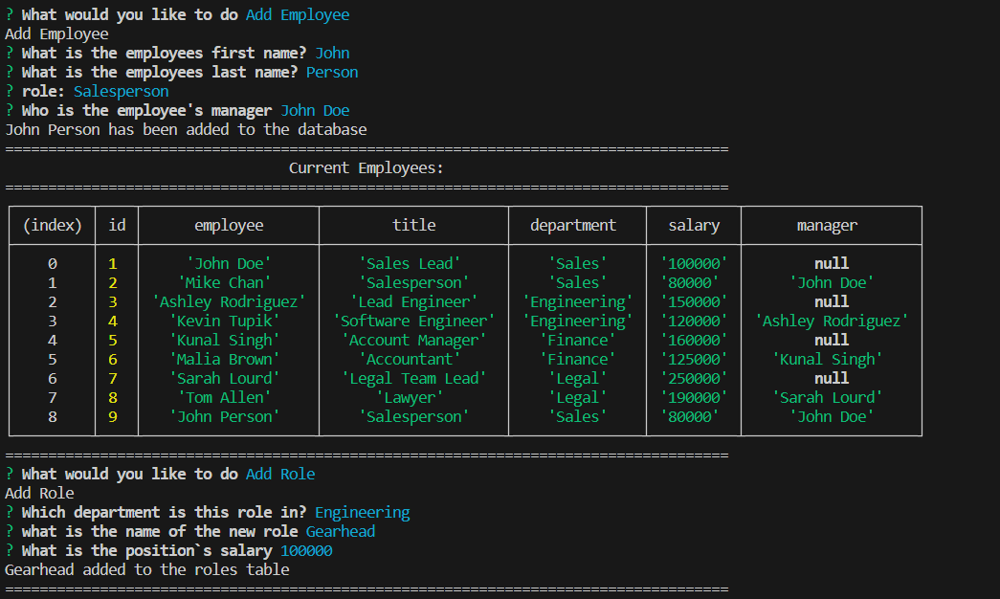

# Employee-Tracker
## Description
This is a Command Line Interface application that allows for the storage of employee/role/department data for a business using MySQL.
## Table of Contents

- [Description](#description)
- [Installation](#installation)
- [Usage](#usage)
- [Questions](#questions)
## Installation
Repository can be cloned from GitHub and running "npm install" from the terminal when in the project directory. User's will also need to have access to the MySQL shell to be able to set up the database.

## Usage
A user will be able to create a database to hold company information, as well as add new employees/roles and departments as needed. They are also able to assign a manager for an employee if one is needed.

## Questions
For any questions you can reach out to me at:

My Email: [ziad.t.alfadl@gmail.com](mailto:ziad.t.alfadl@gmail.com)

My GitHub: [https://github.com/Z-Alfadl](https://github.com/Z-Alfadl)
